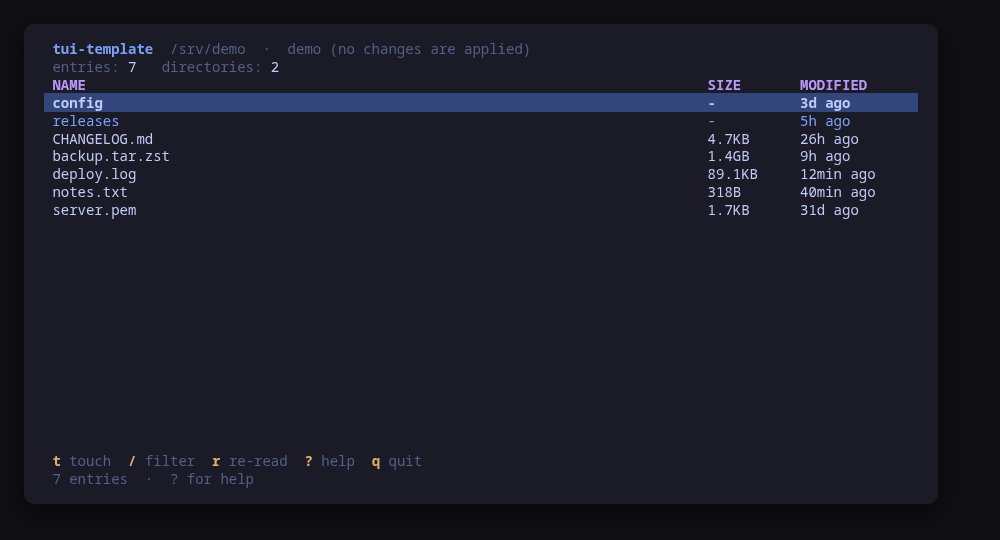
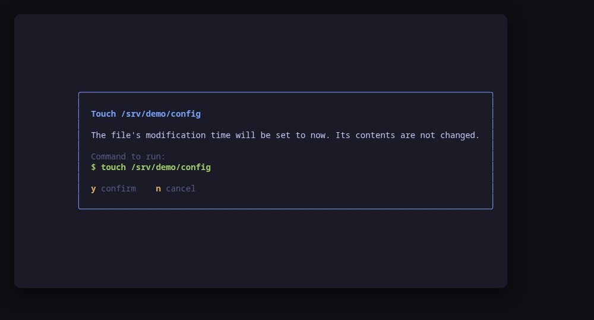

# tui-template

The starting point for a new [tui-tools](https://github.com/tui-tools) tool.
Press **Use this template**, rename it, replace one package, and you have a tool
that looks and behaves like the rest of the family.

It is not a pile of TODOs: it is a working tool. It lists the files in a
directory and can update a file's timestamp, which is deliberately trivial —
what matters is the shape around it, and that shape is already correct.





```sh
make demo     # try it before changing anything
```

## What you get

| From the kit | What it gives you |
| --- | --- |
| `theme` | Tokyo Night, Omarchy theme detection, `NO_COLOR` |
| `ui` | Header, table, help bar, help screen, status line, dialogs |
| `config` | `/etc/<tool>/…` + `~/.config/<tool>/…` + environment + flags |
| `runner` | Preview → confirm → run, escalation, timeouts, and a fake |

| In this repository | What it is |
| --- | --- |
| `cmd/tui-template/main.go` | Flags, configuration, backend selection, program start |
| `cmd/tui-template/app.go` | The Bubble Tea model: one flat update loop |
| `cmd/tui-template/view.go` | The four bands every screen draws |
| `internal/tool/tool.go` | Your model, your action table, your backend interface |
| `internal/tool/real.go` | The backend that touches the machine |
| `internal/tool/fake.go` | The in-memory backend behind `--demo` and the tests |
| `internal/tool/tool_test.go` | The two assertions that matter |
| `.github/workflows/ci.yml` | gofmt, vet, race tests, cross-build, release on a tag |
| `.goreleaser.yaml` | Static linux/amd64 and linux/arm64 archives |
| `Makefile` | `check`, `build`, `demo`, `screenshots` |

## Checklist for a new tool

**1. Pick the name.** Every tool is `tui-<target>`: the repository, the Go
module, the package directory, the binary and the config directory all carry
that one name, with **no aliases**. `tui-firewall`, `tui-systemd`. Use
`tui-<name>-<solution>` only when a target genuinely needs disambiguating.

**2. Rename everything at once.**

```sh
NEW=tui-yourtool
git mv cmd/tui-template "cmd/$NEW"
grep -rl tui-template --include='*.go' --include='*.md' --include='*.yaml' \
  --include='*.yml' --include='*.toml' . Makefile |
  xargs sed -i "s/tui-template/$NEW/g"
go mod edit -module "github.com/tui-tools/$NEW"
go mod tidy && make check
```

**3. Replace `internal/tool`.** Rename the package to your subject
(`internal/systemd`, `internal/containers`). Then, in order:

- **the model** — the struct one row of your list holds, and the sort that puts
  what matters on top;
- **the action table** — one `ActionSpec` per key. The key map, the help screen
  and the confirm dialog are all generated from it, so they cannot drift apart;
- **`BuildCommand`** — intent to argv. Nothing else in the tool may build a
  command line;
- **`Real`** — one `runner.New` per binary you drive, and the reads;
- **`Fake`** — the sample data `--demo` shows, and a `Hook` that applies a
  confirmed command to it the way the real one would.

**4. Adjust the view.** Columns in `view.go`, the header facts, and the widths
at which columns are dropped. Check it at 40 columns as well as 120.

**5. Re-render the screenshots.** `make screenshots` runs the real binary in
`--demo` under a pseudo-terminal, so the README frames are the actual UI:

```make
screenshots: build
	python3 $(KIT)/tools/render-screenshots.py \
		--bin $(BIN)/$(TOOL) --name $(TOOL) --out docs/screenshots \
		--screen main= --screen touch=t --screen help=?
```

Each `--screen` is `name=keys`; the keys are typed once the UI has drawn.

**6. Set the repository up.** Description, topics (`tui`, `terminal`,
`bubbletea`, `go`, `golang`, `omarchy`, plus yours), issues on, wiki and
projects off, delete-branch-on-merge on. Then add the tool to the family list in
[tui-tools/.github](https://github.com/tui-tools/.github).

**7. Release.** `git tag v0.1.0 && git push origin v0.1.0`. CI runs the checks
and GoReleaser attaches the static binaries.

## The rules

These are what make the family a family rather than a folder of unrelated
programs. Keep them, or the tool does not belong in it.

- **Preview, then confirm.** Nothing changes the system without first showing
  the exact command line. Build a `runner.Command`, show it with `ui.Confirm`,
  hand that same value back to the runner. The dialog is the only path to a
  mutation.
- **Read-only by default.** Starting the tool only reads.
- **No daemon, no state of its own.** The system is the source of truth; re-read
  it after every change.
- **`--demo` always works.** It builds and previews every command for real, and
  touches nothing. A reviewer must be able to try the tool without a machine to
  risk.
- **Backend behind an interface.** The UI never names a binary.
- **Small dependencies.** Bubble Tea, Bubbles, Lip Gloss and the kit.
- **English everywhere**: code, comments, commits, UI strings.
- **Responsive.** Layouts adapt from a 40-column pane to a full screen.

## Tests worth writing

`internal/tool/tool_test.go` shows the two that carry the tool:

- **the command that runs is the command the preview showed**, character for
  character — assert on `Fake.Commands()` after driving a key;
- **nothing runs that was not confirmed** — cancel, then assert the fake
  recorded nothing.

Then table tests for every parser, against real command output pasted in
verbatim. When a parser is wrong on someone's machine, their output becomes the
next case.

## License

MIT — see [LICENSE](LICENSE). Part of the
[tui-tools](https://github.com/tui-tools) family.
